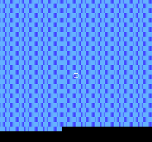

# APU 下与整机合体：三角波、噪声与第一次开机

最后一章的三个翻车点，全都来自「差不多就行」的偷懒。噪声通道用 `Math.random()` 生成随机数，听着是白噪音，可怎么调都没有 8 位机那种沙沙的「齿轮感」——因为真机的噪声不是随机数，是一圈齿轮咬合转出来的确定序列。三角波通道照抄方波的包络，低音声部却整段静音——它没有音量旋钮，开关是另一个机关：线性计数器（linear counter，一个倒着数的闸门，下一节细说）。最扎心的是第三个：所有部件单测全绿，整机合体后屏幕一片黑——不是谁坏了，是渲染发生在每帧进 VBlank 的那一刻、改数据发生在其后的 VBlank 窗口，**这一帧改的数据，下一帧才显示**。单测绿与整机活之间，隔着的就是这些时序常识。

这一章补齐三角波与噪声、接上手柄，然后整机第一次开机。

## 一、三角波：没有音量旋钮的低音

三角波（triangle wave——波形先平滑下坡再平滑上坡，像山坡轮廓的波）听感比方波圆润，NES 用它当低音声部。它的发声机构比方波少一半：一个 32 步的固定序列，数值从 15 逐级下到 0、再逐级回到 15，循环往复。没有占空比选择、没有包络、没有音量——输出就是序列本身，0 到 15 之间。粗糙，但 1983 年的芯片预算就到这了。

开关是线性计数器——三角波专属的 7 位闸门，倒着数、数到 0 就把序列发生器闸住。写 $400B 时装载；control 位（$4008 bit7）置 1 时闸门挂着不放，清 0 则按 quarter 节拍倒数耗尽。上一章我踩的坑就在这：`$4008` 写 `0x80` 想只开 control，低 7 位的重载值是 0——闸门装载了个零，当场闸死。control 和重载值打包在同一个字节里，开闸的时候别忘了给闸门留电量。

```ts
// src/apu/triangle.ts · tickSequence（序列走一步的条件）
tickSequence(): void {
  if (this.timer <= 0) {
    this.timer = this.timerReload
    if (this.linearCounter > 0 && this.length > 0) {
      this.index = (this.index + 1) & 31
    }
  } else {
    this.timer--
  }
}
```

## 二、噪声：一圈会咬合的齿轮

噪声通道（noise——打击乐、枪声、爆炸的「沙沙」声源）的灵魂是 LFSR。LFSR（linear feedback shift register，线性反馈移位寄存器）就是一排格子：每次把「某几格的异或」塞回队头、整体后移一格，像个转盘。它不随机，是确定序列——同一个初值永远转出同一圈，只是这一圈长达三万多种组合，耳朵听不出重复。

「齿轮感」的来源正是这种确定性：白噪音每一瞬间都是新的，LFSR 的沙沙声则是同一个纹理在极快地重复，人耳听感偏「粗、旧、机械」——恰好就是 8 位。用 `Math.random()` 从根上就错了：

```ts
// src/apu/noise.ts · clockLfsr（转盘摇一格）
clockLfsr(): void {
  const feedback = this.mode
    ? (this.lfsr ^ (this.lfsr >> 6)) & 1 // 短序列：改咬 bit6（金属感）
    : (this.lfsr ^ (this.lfsr >> 1)) & 1 // 长序列：咬相邻的 bit1
  this.lfsr = ((this.lfsr >> 1) | (feedback << 14)) & 0x7fff
}
```

模式位选咬合位置（相邻格还是隔六格），周期表 16 档控制摇的快慢——从激光枪的「滋」到军鼓的「沙」。测试里「两次实例序列完全一致」这条断言就是确定性的直接证明：齿轮转多少圈都一样，随机数做不到。其余机关（包络、长度）与方波同款，直接复用上一章的设计。

## 三、手柄：八次读数拆一个快照

手柄接入的是全书最简单的协议。程序往 `$4016` 写 1 再写 0（strobe，选通脉冲——「拍照」指令），手柄把 8 个键的当前状态打包成一字节快照；此后连读 8 次 `$4016`，每次吐出一位（顺序固定：A、B、Select、Start、上、下、左、右），移空的位之后恒读 1。一位数据线传一字节状态，靠的就是移位寄存器（shift register——每次只露一格、整体逐格前移的队列）。

```ts
// src/controller.ts · read（吐一位）
read(): number {
  const bit = this.shifter & 1
  this.shifter = (this.shifter >> 1) | 0x80 // 移空的位补 1（真机行为）
  return bit
}
```

协议的另一半在写侧——「拍照」动作本身就是那个 strobe 脉冲。

```ts
// src/controller.ts · write（strobe 脉冲：写 1 拍快照，写 0 封存）
write(val: number): void {
  if ((val & 1) === 1) {
    // strobe 高电平：把 8 个键态打包进移位寄存器
    this.shifter = 0
    for (let i = 0; i < 8; i++) {
      if (this.buttons.has(ORDER[i])) this.shifter |= 1 << i
    }
  }
  // strobe 落回 0：快照保持，等待被逐位移出
}
```

一个值得注意的细节藏在测试里：strobe 之后中途按下新键，读到的仍是旧快照——「拍照」和「读条」是两个时刻，游戏每帧重拍一次。

## 四、第一次开机

总装完成的 `NES.frame(buttons)` 是全书的终点接口：注入按键、跑满一帧（CPU 按指令前进、PPU 按三倍拍数画帧、APU 同拍发声）、交出画面帧缓冲与音频采样。终章测试卡带是全书自产卡带的收官之作，一个完整的游戏主循环如下。

```text
等 VBlank →
  铺调色板与拼贴图（$2006/$2007 两步礼仪）→
  读手柄：strobe、读 8 次、把 A 键态存进 $0300 →
  发声：pulse1 一颗 A4、triangle 一记低音、noise 一记打击 →
回去等下一帧（NMI 处理程序顺手给 $0400 帧计数 +1）
```

四条终局断言对应四个子系统。帧缓冲的格 (0,0) 是调色板 0 的 1 号色（画面管线）；`$0300` 为 1（手柄管线）；采样流峰值远超静音（三通道同时在响）；帧计数在涨（中断管线）。内置试机带还带自己的回归文件：13 号核对开机画面的四个色彩齐聚、0 号精灵就位、按住 Right 三十帧 X 恰好走到 184；14 号核对滚动相机的跨表取图——你在浏览器里玩到的画面，在 node 侧有断言兜底。第一次跑的时候画面断言红了——正是开篇说的那个「下一帧才显示」：第一帧的 VBlank 铺数据，第二帧的 241 线才把它画出来。把断言挪到第二帧，全绿。这不是实现 bug，是渲染与修改在时间轴上的真实次序：**VBlank 改的永远是下一帧**。

四路声音怎么合成一股？第 11 章的两路线性混音在这里长成最终形态——四通道电平（各 0-15）求和、除以 60 归一：

```ts
// src/apu/index.ts · mix（全文）
private mix(): number {
  return (this.pulse1.emit() + this.pulse2.emit() + this.triangle.currentOutput() + this.noise.emit()) / 60
}
```

分母 60 = 4 × 15：四通道同时满音量时峰值恰好归一到 1。真机的混音是给各通道配了权重的非线性公式，线性版是声明过的教学简化（附录的差异清单有记录）。

```text
$ pnpm test
 ✓ 12 个测试文件、117 个用例全绿（pnpm typecheck 同轮通过）
   卡带解析、总线与镜像、CPU 56 条指令、13 种寻址、
   PPU 记忆与渲染、精灵与命中、帧时序与 NMI、
   四通道 APU、手柄协议、整机 frame() 集成、
   滚动相机、浏览器试机台的内置卡带
```

零外部输入的承诺也在这里兑现：从第 3 章的第一张卡带到现在这张整机演示卡带，全部由 `fixtures/` 里的代码现场拼出，没有下载过任何 ROM，访客克隆实验场即可复现第一次开机。

### 亲手开机

两条命令，零外部输入：

```text
cd companion && pnpm install && pnpm dev
```

浏览器里就是课程的试机台：canvas 上是内置试机带的开机画面——满屏棋盘背景，中间一枚笑脸精灵。方向键推着它走，X 是 A 键、Z 是 B 键、Enter 是 Start；声音由 Web Audio 实时播出，把任意 NROM 格式的 `.nes` 拖进页面还能换卡带。下面这张就是试机台实际渲染出来的画面，帧缓冲里的 61440 个色号一个不差。



第 8 章的位平面、第 9 章的合成规则、第 10 章的 1:3 心跳、这一章的四通道与整机闭环，全部兑现这一张图和这一路声音里。

## 五、终点，与下一道门

你现在的手里有什么：一个约 1400 行的 TypeScript NES 模拟器——CPU 能跑全部 56 条官方指令，PPU 能画背景与 64 个精灵，APU 四通道齐鸣，手柄、中断、帧时序各就各位；外加 117 个用例的测试梯子，每一步「先红后绿」都是原理的机械证明。更重要的是读法：回头翻第 2 章那张总图，每一块你都亲手造过。

还没造的（也写在[附录的差异清单](./ppu-apu-registers)）有三样。一是 DMC 采样通道（放录音的第五声道），二是 1 号以上的 mapper（大容量游戏的换页术），三是逐拍级精确时序（speedrun 级兼容）。它们是同一栋楼更高的楼层——电梯你已经会开了。

## 小结

- 三角波是 32 步固定序列，无音量旋钮；线性计数器是它的闸门，control 与重载值同字节打包。
- 噪声的灵魂是 LFSR 确定序列，齿轮感来自「同一纹理极快重复」；模式位换咬合位置、周期表换转速。
- 手柄协议两步：strobe 拍快照、连读 8 次逐位吐出，移空恒 1。
- 整机 frame() 跑通：画面、手柄、声音、中断四线全通；混音四路求和 /60 归一；VBlank 改的是下一帧，一帧延迟是真实次序。
- 终点：约 1400 行的自产模拟器 + 117 用例测试梯子 + 零外部输入的开机体验（试机台两条命令开机）。

自查：为什么噪声不能用 Math.random()？线性计数器与长度计数器是什么分工？手柄读数为什么每帧要重新 strobe？答完这三问，这门课就毕业了——欢迎来到模拟器作者的世界。

